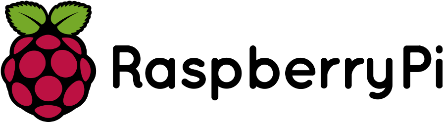

# nixos-raspberrypi

<p align="center">
  
</p>

Unopinionated Nix flake for infrastructure, vendor packages, kernel, and some optimized third-party packages for [NixOS](https://nixos.org/) running on Raspberry Pi devices.

## Table of Contents

- [Quick Start](#quick-start)
- [Features](#features)
- [Usage](#usage)
- [Installer Images](#installer-images)
- [Deployment](#deployment)
- [Alternative Ways to Get Individual Packages](#alternative-ways-to-get-individual-packages)
- [Project Structure](#project-structure)
- [Design Goals](#design-goals)

## Quick Start

### Prerequisites

- [Nix](https://nixos.org/download/) installed with flakes enabled
- For native builds: an aarch64 machine (Raspberry Pi running NixOS, or any aarch64-linux host)
- For cross-compilation: an x86_64 Linux machine

### Option A: Build on a Raspberry Pi (native, aarch64)

```bash
# Clone the repository
git clone https://github.com/nvmd/nixos-raspberrypi.git
cd nixos-raspberrypi

# Build an installer image (choose your board)
nix build .#installerImages.rpi5

# Flash the resulting image to an SD card
# (image path will be in ./result/)
```

### Option B: Cross-compile from x86_64/AMD64

```bash
# Clone the repository
git clone https://github.com/nvmd/nixos-raspberrypi.git
cd nixos-raspberrypi

# Cross-compile an installer image from x86_64
nix build .#installerImagesCross.x86_64-linux.rpi5

# Flash the resulting image to an SD card
# (image path will be in ./result/)
```

Boot the Raspberry Pi from the flashed SD card. Randomly generated connection credentials will be displayed on the screen once the system is booted.

## Features

### Bootloader infrastructure

Manages Raspberry Pi firmware partition `/boot/firmware` (the path is configurable with `boot.loader.raspberry-pi.firmwarePath`).

Partition provisioning is integrated with bootloader activation scripts, happening on NixOS generation switch, enabling to use deployment tools like `nixos-anywhere` without any interactive intervention.

Supported boot methods (configurable with `boot.loader.raspberry-pi.bootloader`):
- `kernelboot` (legacy), default for RPi5
- `uboot`, default bootloader for all other boards
- `kernel`, new generation of `kernelboot`, supporting multiple NixOS generations (see #60), default for RPi5 sd-image/installer images, _recommended_ for new installations.

### Vendor kernel packages with matched firmware

`pkgs.linuxAndFirmware.default` contains compatible:
```nix
linuxPackages_rpi<board model>  # Linux kernel
raspberrypifw                   # Raspberry firmware, device trees (DTBs), device overlays
raspberrypiWirelessFirmware     # wireless firmware
```

Two kernel channels are available:
- **stable** (= default) — well-tested kernel version, suitable for production use
- **latest** — newest available kernel, bumped first when new versions are added

Both are accessible via `pkgs.linuxAndFirmware.stable` and `pkgs.linuxAndFirmware.latest`, and as flake package outputs with `_stable` / `_latest` suffixes (e.g. `linux_rpi5_stable`, `linux_rpi5_latest`).

### 3rd-party optimised packages

Overlays containing vendor and optimized packages, like `libcamera`, `vlc`, `kodi`, and RPi-optimized FFmpeg builds from the [official Raspberry Pi fork](https://github.com/jc-kynesim/rpi-ffmpeg) with hardware-accelerated video decode via V4L2 and zero-copy GPU pipelines. See the [FFmpeg documentation](docs/ffmpeg.md) for details.

### Cross-compilation support

Build Raspberry Pi packages and installer images directly from your x86_64 (AMD64) workstation without QEMU emulation:

```bash
# Cross-compile RPi 5 kernel from x86_64:
nix build .#packages.x86_64-linux.linux_rpi5

# Cross-compile stable/latest kernel variants:
nix build .#packages.x86_64-linux.linux_rpi5_stable
nix build .#packages.x86_64-linux.linux_rpi5_latest

# Cross-compile RPi 5 installer image:
nix build .#installerImagesCross.x86_64-linux.rpi5
```

This uses native cross-compiler toolchains for fast builds. Supported build hosts are `x86_64-linux` and `aarch64-linux` — the two architectures with well-tested nixpkgs cross-compilation and Hydra binary cache coverage. See the [Cross-Compilation Guide](docs/cross-compilation.md) for detailed documentation.

## Usage

### Adding the flake input

```nix
inputs = {
  # follow `main` branch of this repository, considered being stable
  nixos-raspberrypi.url = "github:nvmd/nixos-raspberrypi/main";
};

# Optional: Binary cache for the flake
nixConfig = {
  extra-substituters = [
    "https://nixos-raspberrypi.cachix.org"
  ];
  extra-trusted-public-keys = [
    "nixos-raspberrypi.cachix.org-1:4iMO9LXa8BqhU+Rpg6LQKiGa2lsNh/j2oiYLNOQ5sPI="
  ];
};
```

### Creating a NixOS configuration

There are helper functions intended to be used as a drop-in replacement for
`nixpkgs.lib.nixosSystem`:

- `nixos-raspberrypi.lib.nixosSystem`
- `nixos-raspberrypi.lib.nixosSystemFull` - same as above, but with RPi-optimized overlays applied globally, this may lead to more rebuilds
- `nixos-raspberrypi.lib.nixosInstaller` - same as `nixosSystemFull` but with additional installer-specific modules

All of them take the following additional optional arguments:

- `nixpkgs` – default = nixpkgs of the `nixos-raspberrypi` will be used
- `trustCaches` – default=true, trust binary caches of `nixos-raspberrypi`

```nix
nixosConfigurations.rpi5-demo = nixos-raspberrypi.lib.nixosSystem {
  specialArgs = inputs;
  modules = [
    {
      # Hardware specific configuration, see section below for a more complete
      # list of modules
      imports = with nixos-raspberrypi.nixosModules; [
        raspberry-pi-5.base
        raspberry-pi-5.page-size-16k
        raspberry-pi-5.display-vc4
        raspberry-pi-5.bluetooth
      ];
    }

    ({ config, pkgs, lib, ... }: {
      networking.hostName = "rpi5-demo";

      system.nixos.tags = let
        cfg = config.boot.loader.raspberry-pi;
      in [
        "raspberry-pi-${cfg.variant}"
        cfg.bootloader
        config.boot.kernelPackages.kernel.version
      ];
    })

    # ...

  ];
};
```

See also: <https://github.com/nvmd/nixos-raspberrypi-demo>, [Installer Images](#installer-images).

### Choosing hardware modules

See `modules/default.nix` for a full list of configuration modules for your hardware.
Here is the list of the most important:

```nix
imports = with nixos-raspberrypi.nixosModules; [
  # Base board support modules
  raspberry-pi-02.base
  raspberry-pi-3.base
  raspberry-pi-4.base
  raspberry-pi-5.base

  # (Potentially) All boards
  usb-gadget-ethernet # Configures USB Gadget/Ethernet - Ethernet emulation over USB

  # RPi4:
  # import this if you have the display, on rpi4 this is the only display configuration option
  raspberry-pi-4.display-vc4

  # RPi5:
  raspberry-pi-5.page-size-16k  # Recommended: optimizations and fixes for issues arising from 16k memory page size (only for systems running default rpi5 (bcm2712) kernel)
  # use one of following for the "PrimaryGPU" configuration:
  raspberry-pi-5.display-vc4  # "regular" display connected
  raspberry-pi-5.display-rp1  # for RP1-connected (DPI/composite/MIPI DSI) display
];
```

### Configuring the bootloader and firmware (`config.txt`)

Sane default configuration is provided by the base module for a corresponding Raspberry board, but further configuration is, of course, possible:

Configuration options for the bootloader are in `boot.loader.raspberry-pi` (defined in `modules/system/boot/loader/raspberrypi/default.nix`).

Raspberry's `config.txt` can be configured with `hardware.raspberry-pi.config` options, see `modules/configtxt.nix` as an example (this is the default configuration as provided by RaspberryPi OS, but translated to nix format).

### Advanced usage

Options for a more fine-grained control:

- see implementation details in `lib/default.nix`, `lib/internal.nix`
- Use `nixos-raspberrypi.lib.int.nixosSystemRPi` instead of `nixos-raspberrypi.lib.nixosSystem`
- Use regular `nixpkgs.lib.nixosSystem` importing the modules manually, see
below

```nix
imports = with nixos-raspberrypi.nixosModules; [

  # Required: Add necessary overlays with kernel, firmware, vendor packages
  nixos-raspberrypi.lib.inject-overlays

  # Binary cache with prebuilt packages for the currently locked `nixpkgs`,
  # see `dev-shells/nix-build-to-cachix.nix` for a list
  trusted-nix-caches

  # Optional: All RPi and RPi-optimised packages to be available in `pkgs.rpi`
  nixpkgs-rpi

  # Optional: add overlays with optimised packages into the global scope
  # provides: ffmpeg_{7,8}, kodi, libcamera, vlc, etc.
  # This overlay may cause lots of rebuilds (however many
  #  packages should be available from the binary cache)
  nixos-raspberrypi.lib.inject-overlays-global
];
```

## Installer Images

The flake provides installation SD card images for Raspberry Pi Zero2, 3, 4, and 5, based on <https://github.com/nix-community/nixos-images>. They have several advantages over the "standard" ones, making the installation more user-friendly: mDNS enabled, `iwd` for easier wlan configuration, etc.

Note: these images are mutable, i.e. they're suitable to be used both as an installation media, and as a ready to use system on the sd-card. The partition table will be expanded to use all the available space during the first boot.
This can be helpful for boards with a single storage device option, like RPi Zero/Zero 2.

> [!TIP]
> Installer images use new generational bootloader for RPi5 by default (see #60),
> to keep that in your configuration, set `boot.loader.raspberry-pi.bootloader = "kernel"`.
> This is _recommended_ for new installations.

See `installers/default.nix` for installer configurations (`nixosConfigurations.rpi{02,3,4,5}-installer`).

SD image can be built with:

```
nix build .#installerImages.rpi02
nix build .#installerImages.rpi3
nix build .#installerImages.rpi4
nix build .#installerImages.rpi5
```

Zstd-compressed images (smaller, need to be decompressed before flashing):

```
nix build .#installerImagesZstd.rpi02
nix build .#installerImagesZstd.rpi3
nix build .#installerImagesZstd.rpi4
nix build .#installerImagesZstd.rpi5
```

Flash the resulting image to an SD card (replace `/dev/sdX` with your SD card device):

```bash
sudo dd if=./result/sd-image/nixos-installer-rpi5-kernel.img of=/dev/sdX bs=10M oflag=dsync status=progress
```

For zstd-compressed images, decompress and flash in one step:

```bash
zstdcat ./result/sd-image/nixos-installer-rpi5-kernel.img.zst | sudo dd of=/dev/sdX bs=10M oflag=dsync status=progress
```

To build all installer images at once (4 models × raw + zstd-compressed = 8 images):

```bash
nix build .#checks.x86_64-linux.all-installer-images
```

Randomly generated connection credentials will be displayed on the screen, once the system is booted.

Network access to Raspberry Pi Zero2 (RPi02) boards is also possible via USB Gadget/Ethernet functionality.

> [!TIP]
> You can optionally replace `# YOUR SSH PUB KEY HERE #` in `custom-user-config`
> (in `installers/default.nix`) with your SSH public key to generate the image with
> your SSH key already baked in

`.#nixosConfigurations.rpi{02,3,4,5}-installer.config.system.build.toplevel` are included in the binary cache.

Sophisticated demo configurations are available in <https://github.com/nvmd/nixos-raspberrypi-demo>.

Installer configurations can also double as configuration examples.

## Deployment

For example, with `nixos-anywhere` to the system running installer image (will use [disko](https://github.com/nix-community/disko/) to set the disks up):

```shell
nixos-anywhere --flake .#<system> root@<hostname>"
```

Or, to an already running system (to change configuration of it):

```shell
nixos-rebuild switch --flake .#<system> --target-host root@<hostname>
```

It will let you deploy [NixOS](https://nixos.org/) fully declaratively in one step with tools like [nixos-anywhere](https://github.com/nix-community/nixos-anywhere/) (note: `kexec` is, unfortunately, not supported).

## Alternative Ways to Get Individual Packages

Alternative ways to consume individual packages without overlays:

- Get it directly from the flake, it will be based on stable `nixpkgs` _without_ any of other optimisations transitively applied (i.e. only this particular package is optimised):

```nix
  environment.systemPackages = [
    nixos-raspberrypi.packages.aarch64-linux.vlc
  ];
```

  Kernel packages are also available with `_stable` and `_latest` suffixes (e.g. `linux_rpi5_stable`, `linux_rpi5_latest`).

- Get it from `nixos-raspberrypi.legacyPackages.<system>`. Here all overlays are applied.

## Project Structure

```
.
├── flake.nix              # Thin orchestrator — wires outputs from each directory
├── lib/                   # Public library, system lists, package set constructors
│   ├── default.nix        # Public API: nixosSystem, nixosSystemFull, nixosInstaller
│   ├── internal.nix       # Implementation details
│   ├── systems.nix        # Target/build system lists and iteration helpers
│   └── pkgs.nix           # Package set constructors (native, cross, smart)
├── modules/               # NixOS modules (bootloader, board configs, features)
│   └── default.nix        # `nixosModules` flake output
├── overlays/              # Nixpkgs overlays (kernel, firmware, vendor packages)
│   └── default.nix        # Overlay definitions and canonical RPi overlay list
├── pkgs/                  # Package definitions (kernels, ffmpeg, camera, etc.)
│   └── default.nix        # `packages` flake output
├── installers/            # Installer builders, nixosConfigurations, installer images
│   └── default.nix        # Installer output definitions
├── dev-shells/            # `devShells` flake output and helpers
└── docs/                  # Additional documentation (cross-compilation guide)
```

## Design Goals

This is basically [`boot.loader.raspberryPi` options](https://search.nixos.org/options?channel=unstable&show=boot.loader.raspberryPi), which are deprecated in nixpkgs, but updated and improved upon.

Design objectives:

- individually consumable modules and overlays for specific functions
- reuse of the existing nixos/nixpkgs infrastructure and idiomatic approaches to the maximum extent possible
- integration with the existing nixos system activation

### Historical background

This project grew naturally out of the need to configure and extend rather great [tstat's raspberry pi support repository](https://github.com/tstat/raspberry-pi-nix), which we used for some time.

Unfortunately it was virtually impossible to work with it without reengineering the whole thing, so this Flake was born. Inability to use it non-interactively with `nixos-anywhere` was the biggest concern.

We found [`boot.loader.raspberryPi` options](https://search.nixos.org/options?channel=unstable&show=boot.loader.raspberryPi) to be much more idiomatic, easier to extend, and maintain.

This flake strives to keep and improve those properties by keeping it as unopinionated as possible and modular (see [above](#design-goals))

We're still using some of the modules provided by an adapted fork of tstat/raspberry-pi-nix, namely `config.txt` generation module.
